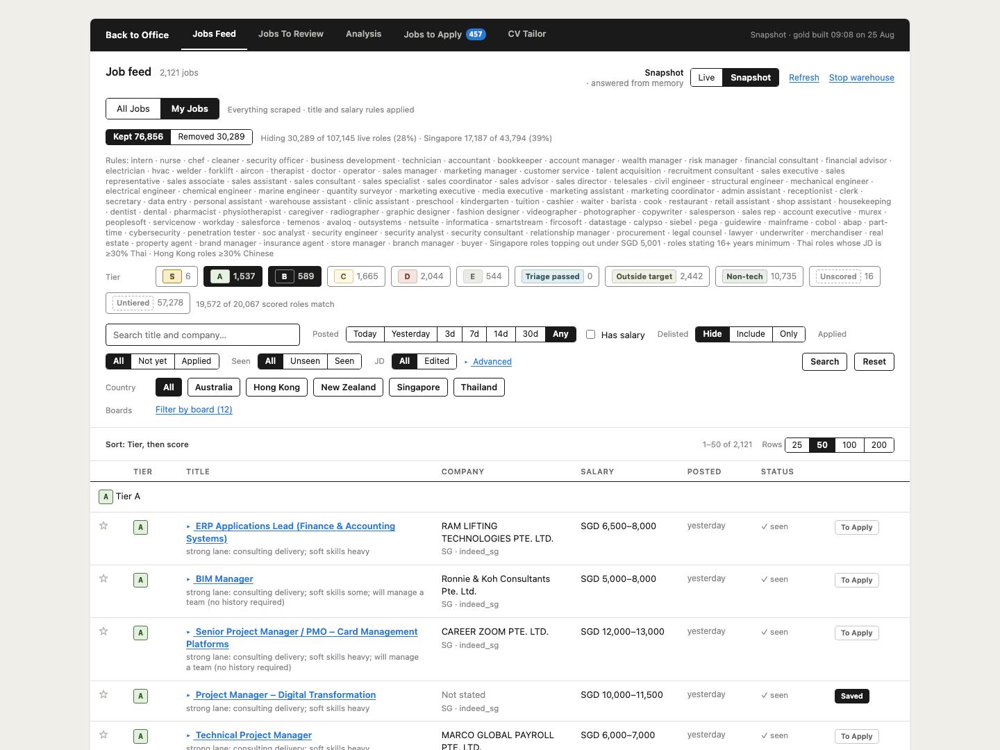

# Back to Office

**A job search pipeline built to make finding a job less of a full-time job.**

Back to Office runs B's searches across multiple job boards every day,
collects new and updated listings, deduplicates the same jobs appearing across
different sources, and filters and ranks what remains.

Instead of reading thousands of JDs, B reviews around 300 in a web interface,
with the system surfacing the key reasons for and against each job. B makes the
final decision on what is worth applying for.

For selected jobs, Back to Office then tailors a CV against B's evidence bank,
researches the original job opening and relevant hiring contacts, and helps with
the application and outreach process.

Finally, it tracks what happens after applying — from recruiter interest and CV
link clicks to recruiter calls, interviews, offers and rejections.

The aim isn't to automate the decision of where B should work. It's to automate
as much of the work around that decision as possible.

<p align="center">
  <picture>
    <source srcset="demo.webp" type="image/webp">
    
  </picture>
</p>

<p align="center">
  <a href="https://www.python.org/"></a>
  <a href="https://www.postgresql.org/"></a>
  <a href="https://www.databricks.com/"></a>
  <a href="https://spark.apache.org/"></a>
  <a href="https://delta.io/"></a>
  <a href="https://aws.amazon.com/lightsail/"></a>
  <a href="LICENSE"></a>
</p>

## How it works

```
┌─ 1 ─ find new job listings ────────────────────────────────────────────────────────────────┐
│   ├─ run B's searches across job boards such as LinkedIn, Indeed, JobStreet and            │
│   │  MyCareersFuture, across various markets e.g. Singapore, Hong Kong, Thailand           │
│   ├─ MyCareersFuture and JobStreet return summary cards, so download the job               │
│   │  description only when the card is new or its change signal moved. Indeed and          │
│   │  LinkedIn return the description with the search result, so there is nothing           │
│   │  to re-request                                                                         │
│   ├─ save each payload as raw JSON in a Databricks Bronze volume                           │
│   ├─ write one Bronze observation per job seen — board job id, change signal and           │
│   │  content hash — the state the next run compares against                                │
│   └─ record each Apify run's reported cost in PostgreSQL; a cost write that fails          │
│      is logged and reported, never a reason to fail the scrape                             │
└──────────────────────────────────────────────┬─────────────────────────────────────────────┘
                                               │  ~4,500 new or edited job listings saved each day
                                               ▼
┌─ 2 ─ standardize and canonicalize job listings ────────────────────────────────────────────┐
│   ├─ standardize listings from every job board into one common schema                      │
│   ├─ preserve the richest available job description and derive clean text for matching     │
│   ├─ build matching features such as MinHash and compare likely duplicates across boards   │
│   └─ group listings that represent the same job under one canonical job                    │
└──────────────────────────────────────────────┬─────────────────────────────────────────────┘
                                               │  ~3,000 job listings to filter and rank
                                               ▼
┌─ 3 ─ filter and rank job listings ─────────────────────────────────────────────────────────┐
│   ├─ rule-based logic to remove irrelevant job listings e.g. where the job title           │
│   │  contains nurse, lawyer, electrician or sales manager; 16+ years experience            │
│   │  demanded; the job listing is mostly in Thai or Chinese                                │
│   ├─ LLM-based triage pass to filter out non-technical roles                               │
│   ├─ key data extraction on the listings that pass triage — e.g. years                     │
│   │  of experience, hard skills, certifications, work authorisation,                       │
│   │  education, etc.                                                                       │
│   └─ scoring and tiering: logic rules weigh the data extracted from each JD                │
│      against B's profile and preferences, and tiers each JD from A to E. S-tier is a pin B │
│      places by hand.                                                                       │
└──────────────────────────────────────────────┬─────────────────────────────────────────────┘
                                               │  ~300 new JDs to review each day
                                               ▼
┌─ 4 ─ manually review JDs ──────────────────────────────────────────────────────────────────┐
│  PostgreSQL                                                                                │
│  B reviews each JD that made it past triage and filtering in a web interface               │
│   ├─ spend ~12 seconds per JD, ~1 hour for the ~300 JDs that arrive each day               │
│   └─ back-to-office system surfaces the key points for and against each job, including     │
│      the reasoning behind its assigned tier                                                │
└──────────────────────────────────────────────┬─────────────────────────────────────────────┘
                                               │  ~100 jobs saved to apply
                    ┌──────────────────────────┴────────────────────┐
                    ▼                                               ▼
┌─ 5a ─ tailor custom CV ──────────────┐  ┌─ 5b ─ research job opening and enrich data ──────┐
│   ├─ read the JD and work out the    │  │   ├─ find the original job opening on the        │
│   │  angle: what is really being     │  │   │  employer's careers site, where available    │
│   │  hired for, and where B fits     │  │   ├─ extract any recruiter or hiring manager     │
│   ├─ match that to B's evidence bank │  │   │  named in the JD, along with contact details │
│   │  — real projects, numbers, dates │  │   │  if available                                │
│   ├─ anti-hallucination pass: every  │  │   ├─ search the web for more information on the  │
│   │  claim must trace to a line in   │  │   │  hiring manager, recruiter and relevant team │
│   │  the bank, or it is cut and the  │  │   │  members, including LinkedIn profiles, phone │
│   │  draft loops until clean         │  │   │  numbers and email addresses                 │
│   └─ render an ATS-readable PDF      │  │   └─ store enriched data                         │
└──────────────────────────────────────┘  └──────────────────────────────────────────────────┘
                    └──────────────────────────┬────────────────────┘
                                               ▼
┌─ 6 ─ apply for selected jobs ──────────────────────────────────────────────────────────────┐
│   ├─ B submits job applications manually initially                                         │
│   ├─ later, OpenClaw takes over repetitive form filling, leaving applications              │
│   │  open for B to review before submission                                                │
│   └─ use the job and contact data gathered earlier to send targeted outreach               │
│      to relevant hiring managers or recruiters for selected applications                   │
└──────────────────────────────────────────────┬─────────────────────────────────────────────┘
                                               │
                                               ▼
┌─ 7 ─ track job applications ───────────────────────────────────────────────────────────────┐
│   ├─ track links embedded in each CV; log clicks as indicators of recruiter interest       │
│   │  and update the application database accordingly                                       │
│   ├─ B's ElevenLabs assistant answers recruiter calls, answers common questions and        │
│   │  gathers key information about the role and next steps                                 │
│   ├─ log recruiter calls against the application and email B a summary after each call     │
│   └─ track application progress — applied, recruiter interest, interview, offer,           │
│      rejected or no response                                                               │
└────────────────────────────────────────────────────────────────────────────────────────────┘
```

## Structure

```text
back-to-office/
├── AGENTS.md
├── Makefile
├── pyproject.toml
├── deploy/
└── src/bto/
    ├── settings.py            # env, secrets, which boards are switched on
    │
    ├── fetch_job_listings/    # 1 — find and ingest new job listings
    │                          #     http_client.py and apify_client.py live in here
    ├── clean_job_listings/    # 2 — standardize and canonicalize job listings
    ├── filter_and_rank/       # 3 — filter jobs and sort into tiers
    ├── review_jds/            # 4 — review JDs and decide which jobs to apply for
    ├── tailor_cvs/            # 5a — tailor custom CVs for each job application
    ├── research_job_listing/  # 5b — research openings and hiring team
    ├── apply_for_jobs/        # 6 — applications and targeted outreach
    ├── track_applied_jobs/    # 7 — track application interest and progress
    │
    ├── web/                   # web interface and API
    ├── analytics/             # data analyses
    ├── record_costs/          # track operating and API costs
    ├── send_notifications/    # send system alerts and summaries
    │
    ├── storage/
    │   ├── databricks/        # medallion layers and raw volumes
    │   ├── postgres/          # operational database (OLTP)
    │   └── s3/                # read and write data from S3 bucket
    │
    └── sync/                  # move data between Databricks and PostgreSQL
```

## License

[MIT](LICENSE) © 2026 Belinda H. J. Wan
